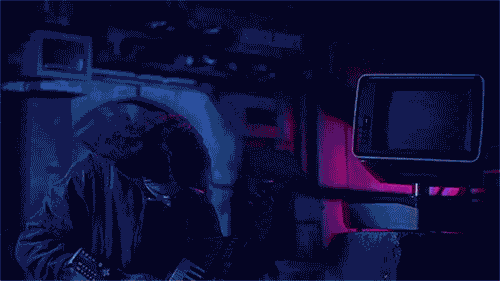

### Hello World 👋

#### EN

Hey there, thank you for stopping by!

- 🙋‍♂️ My name is Matheus
- 🎓 I'm graduated at Instituto Federal de São Paulo
- 🎓 Currently, studying Computer Science on UNIP
- 👨‍💻 I'm a Full-Stack Developer   
  - Programming languages I'm learning:
    - TBA
  - Programming languages I've learned:
    - Python (my first one, yay!)
    - Java
      - Java for Android
      - JSP  
    - Javascript
    - PHP
    - C
- 💜 I love Free and Open Source Software
- 🕴 I'm a privacy concerned person

> ❤️ Developing | Software freedom

#### PT-BR

Opa, e aí?

- 🙋‍♂️ Me chamo Matheus
- 🎓 Sou graduado no Instituto Federal de São Paulo
- 🎓 Atualmente, cursando Ciência da Computação na UNIP
- 👨‍💻 Sou um Desenvolvedor Full-Stack
  - Linguagens de programação que estou aprendendo:
    - TBA
  - Linguagens de programação que aprendi:
    - Python (a primeira, yay!)
    - Java
      - Java para Android
      - JSP
    - Javascript
    - PHP
    - C
- 💜 Amo Software Livre e de Código Aberto
- 🕴 Me preocupo com privacidade

> ❤️ Desenvolviemnto | Liberdade de Software

# _**ＦＥＥＬ ＴＨＥ ＳＹＮＴＨ**_

> I love music from the 80s (specially those in the Synthpop genre) and, nowadays, from the Synthwave and Vaporwave genres. I listen to them while programming :p\
> Amo músicas dos anos 80 (especialmente as do gênero Synthpop) e, atualmente, dos gêneros Synthwave e Vaporwave. Ouço-as enquanto programo :p
#### Ｓｅｅ ｙａ 👋

Last update on: 2022/08/13 (YYYY/MM/DD)
